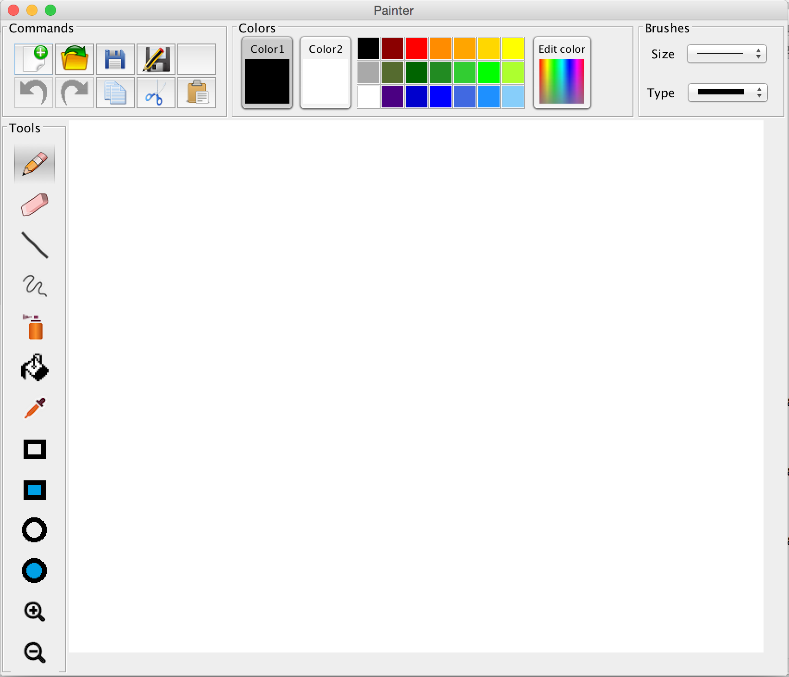

# Paint

There is no default Paint app for Mac, so I created an alternative simple paint application in Java with several tools and functions:

### Tools

- Brush/Pencil (w/ various colors and widths)
- Eraser (w/ various widths)
- Sprayer (w/ various colors and widths)
- Filler (w/ various colors)
- Line Creator (solid or dashed)
- Square/Rectangle Creator (hollow or filled)
- Circle/Oval Creator (hollow or filled)
- Magnifer

### Functions

- Open/Save files
- Undo/Redo
- Copy/Cut/Paste
- Select/Switch Colors
- Select Brush Size/Type

	

## Usage

1. Clone this repo
2. `cd Paint/src` and compile the code
3. `Java Main`
